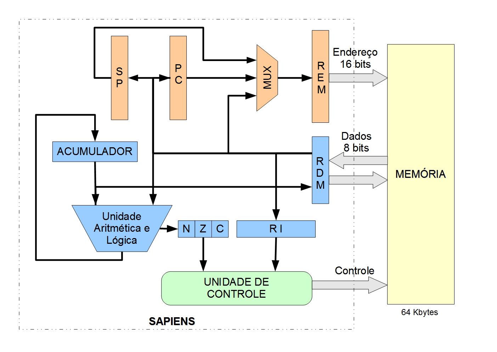

# Simulador SimuS

## Apresentação

O **SimuS** é um simulador desenvolvido para o processador didático **Sapiens**, detalhado no livro **Arquitetura e Organização de Computadores - Uma Introdução** (Editora LTC - 2024). Este livro é fruto da vasta experiência dos autores ao longo de anos ministrando cursos de graduação em áreas tecnológicas. Sua missão é apresentar, de maneira acessível, o funcionamento dos computadores a alunos de disciplinas de Organização ou Arquitetura de Computadores, abrangendo cursos como Bacharelado em Ciência da Computação, Engenharia de Computação, Bacharelado em Sistemas de Informação, Licenciatura em Computação, Cursos Superiores de Tecnologia e, mais recentemente, Ciência de Dados.

O uso de exemplos de programas em linguagem de montagem é enfatizado como crucial para a compreensão, e para isso, é disponibilizado um simulador didático gratuito no repositório [Simulador Simus](https://github.com/Simulador-Simus/SimuS), contendo código-fonte, executáveis para diversos sistemas operacionais e um manual detalhado. Além disso, todos os exemplos em linguagem de montagem utilizados no livro e respostas para os exercícios propostos no Capítulo de Linguagem de Montagem estão disponíveis no mesmo repositório.

## Características do Simulador

No simulador SimuS mantivemos a interface básica do seu predecessor, o simulador Neanderwin, mas com o acréscimo de algumas funcionalidades. Desde o início do projeto nosso objetivo era facilitar ao máximo as atividades didáticas do professor e o apoio mais completo possível para as dificuldades comuns do aluno. Para isso foi disponibilizado um ambiente integrado para desenvolvimento, com versões para os sistemas operacionais Windows e Linux, com os seguintes módulos: 
- **Editor de textos** integrado, que possibilita a abertura, edição e  salvamento  de  arquivos em linguagem de montagem.
- **Montador (assembler)** também integrado, gerando o código  objeto final em  linguagem  de   montagem. Possui compatibilidade com programas escritos para os processadores Neander ou Neander-X.
- **Simulador** da arquitetura, com possibilidade, além da visualização, de modificação dos  elementos   arquiteturais do processador, tais como registrador de instrução, apontador de instrução, apontador de pilha, acumulador, flags N, Z e C; além da execução passo-a-passo ou direta.
- **Módulo de depuração**, definindo pontos de parada e variáveis em  memória para serem monitoradas,  em caso de mudança de valor a execução é interrompida.
- **Visualização** e modificação da memória simulada, no formato hexadecimal os endereços e também para seu conteúdo, agora expandida para 64 Kbytes.
- **Ferramenta de apoio** ao aprendizado de instruções, com  ajuda integrada ao editor de textos,  para  a geração de  código em  linguagem  de montagem  do processador Sapiens.
- **Utilitário** para conversão de bases binária, decimal e hexadecimal.
- **Simulador de dispositivos de E/S**,  que inclui os tradicionais painel com 8 chaves e visor hexadecimal, além de um teclado de 12 teclas e um “banner” de 16 linhas. Estes  dispositivos  são acessados no espaço de endereçamento de E/S convencional com as instruções IN e OUT.
- **Dispositivos especiais** como uma  console  virtual, acessada  pelo  mecanismo de TRAP descrito em detalhes na documentação. Com esse mecanismo   outros   módulos   mais complexos  possam   ser  facilmente   instalados,  sem necessidade  de   expor   esta   complexidade   para   osusuários.
- **Gerador/carregador de imagem** da memória simulada, podendo ser salva em formato hexadecimal. Note que neste caso a compatibilidade entre o Simus e o Neanderwin não é mantida, ou seja, a imagem salvaem um simulador não pode ser carregada em outro.

O processador Sapiens tem um modelo de arquitetura cujo diagrama em blocos pode ser visalizado a seguir:

Ao longo do tempo diversos acréscimos foram feitos ao simulador SimuS, entre os quais destacamos:
- **Arduino**: a possibilidade de controlar atuadores e sensores conectados aos pinos de um Arduino, que por sua vez está ligado ao hospedeiro via interface USB, com uso do protocolo Firmata. 
- **Raspberyy Pi**: o simulador pode ser compilado e executado no Raspberry Pi, controlando sensores e atuadores que estejam conectados à sua interface GPIO. 
- **Python**: uma versão do simulador para uma extensão do processador Sapiens com um acumulador de 16 bits foi desenvolvida na linguagem python.
  
## Recursos Disponíveis

- [Manual do Sapiens](./simus.pdf)
- [Simulador Simus](https://github.com/Simulador-Simus/SimuS)
- [Código dos exemplos utilizados](https://github.com/Simulador-SimuS/SimuS/tree/master/Exemplos)
- Slide de apoio para o conteúdo do Livro **Arquitetura e Organização de Computadores**:
    - [Slides do Capítulo 1](./docs/Capítulo 1.pdf)
    - [Slides do Capítulo 2](./docs/Capítulo 2.pdf)
    - [Slides do Capítulo 3](./docs/Capítulo 3.pdf)
    - [Slides do Capítulo 4](./docs/Capítulo 4.pdf)
    - [Slides do Capítulo 5](./docs/Capítulo 5.pdf)
    - [Slides do Capítulo 6](./docs/Capítulo 6.pdf)
    - [Slides do Capítulo 7](./docs/Capítulo 7.pdf)
    - [Slides do Capítulo 8](./docs/Capítulo 8.pdf)

<!-- Google tag (gtag.js) -->

